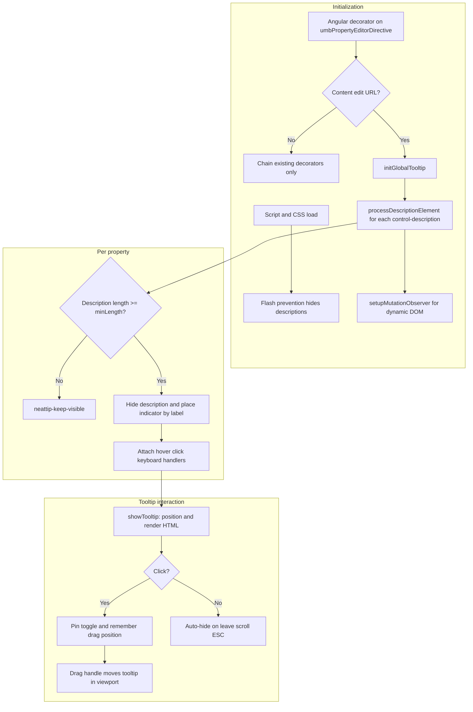
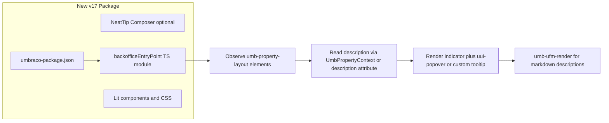

# NeatTip — Developer & Migration Guide

> Technical documentation for the Umbraco 13 implementation and guidance for redeveloping NeatTip on Umbraco 17+.

For installation, usage, and troubleshooting, see [README.md](README.md).

For Umbraco 17+ permission-aware tooltip actions (Copy / Edit helper text), see [NeatTip-PERMISSIONS.md](NeatTip-PERMISSIONS.md).

---

## 1. Introduction and Scope

### What NeatTip Is

NeatTip is a **backoffice-only UX enhancement**. It is **not** a property editor and does not change stored content or data types.

It intercepts Umbraco's default rendering of property descriptions in the content editor, hides the inline description text, and adds a small **info indicator** next to the property label. The full description (including HTML formatting) is shown in a **global, draggable tooltip** on hover (desktop) or click/toggle (all devices).

### What NeatTip Is Not

- No server-side C# logic beyond manifest registration
- No property value conversion or validation
- No changes to document type configuration
- No activation outside content editing (by design)

### Package Versions

| Target | Status |
|--------|--------|
| Umbraco 13 | Current implementation in this repository |
| Umbraco 17+ | Requires a **new package project** — the AngularJS code cannot be ported as-is |

### Source Files

| File | Role |
|------|------|
| [`Phases.Umbraco.NeatTip/App_Plugins/Phases.Umbraco.NeatTip/js/neatTipController.js`](Phases.Umbraco.NeatTip/App_Plugins/Phases.Umbraco.NeatTip/js/neatTipController.js) | All runtime logic (~900 lines) |
| [`Phases.Umbraco.NeatTip/App_Plugins/Phases.Umbraco.NeatTip/css/style.neattip.css`](Phases.Umbraco.NeatTip/App_Plugins/Phases.Umbraco.NeatTip/css/style.neattip.css) | Flash prevention, indicator, tooltip, accessibility, dark mode |
| [`Phases.Umbraco.NeatTip/App_Plugins/Phases.Umbraco.NeatTip/package.manifest`](Phases.Umbraco.NeatTip/App_Plugins/Phases.Umbraco.NeatTip/package.manifest) | Asset registration (Umbraco 13) |
| [`Phases.Umbraco.NeatTip/Composers/NeatTipManifestComposer.cs`](Phases.Umbraco.NeatTip/Composers/NeatTipManifestComposer.cs) | `IManifestFilter` — registers JS/CSS via C# as well |

---

## 2. High-Level Architecture (Umbraco 13)



### Integration Model

1. **Asset loading** — `package.manifest` registers JS and CSS with `bundleOptions: "None"`. `NeatTipManifestComposer` duplicates this via `IManifestFilter` for NuGet installs.
2. **Hook point** — AngularJS `$provide.decorator` on `umbPropertyEditorDirective`. This runs whenever a property editor is linked in the backoffice.
3. **Decorator chaining** — The decorator preserves any existing `compile` function from other packages (e.g. TextboxIcons) and calls them before/after NeatTip's link logic. Load order between decorators does not break either package.
4. **Activation guard** — `isInContentNode()` restricts processing to `#/content/content/edit/` URLs only.

---

## 3. JavaScript Logic

### 3.1 Flash Prevention IIFE (lines 15–121)

Runs **before Angular initializes** to prevent descriptions from flashing on screen before icons are created.

**Context check** — `isContentEditingContext()`:
- Activates when URL contains `#/content/content/edit/` OR `#/content/` (excluding `#/content/settings/`)
- Broader than the main `isInContentNode()` guard (see [§7 Known Edge Cases](#7-known-edge-cases-and-compatibility))

**Mechanism:**
1. Injects `<style id="neattip-flash-prevention">` setting `visibility: hidden` on `.control-description` inside property containers
2. Also sets `visibility: hidden` inline on matching elements via JavaScript
3. Skips elements already marked `neattip-keep-visible` or `neattip-processed`

**Safety fallback:**
- After 3 seconds, restores visibility on any still-hidden descriptions that were not processed
- Adds `neattip-keep-visible` to restored elements so they stay visible

**Dynamic content:**
- `MutationObserver` on `document.body` hides newly added descriptions within property containers

**Cleanup:**
- Exposes `window.neattipFlashPreventionCleanup()` — called by the main Angular code after successful processing to cancel the 3s fallback

### 3.2 Configuration

```javascript
var config = {
    minLength: 0,              // Minimum characters to transform description
    tooltipDelay: 200,          // Delay before showing tooltip (ms)
    tooltipMaxWidth: 320,       // Maximum tooltip width (px)
    indicatorChar: 'i',         // Character shown in indicator
    fadeSpeed: 150              // Animation speed (ms) — defined but CSS handles transitions
};
```

**Note:** The user-facing README references `ℹ` as the default icon, but the source code uses `'i'`. Decide which character to use when reimplementing for v17.

### 3.3 Global State

| Variable | Purpose |
|----------|---------|
| `globalTooltip` | Single `div.neattip-tooltip` appended to `document.body` |
| `activeIndicator` | DOM reference to the indicator that opened the current tooltip |
| `isTouchDevice` | Detected via `'ontouchstart' in window` or `navigator.maxTouchPoints` |
| `isTooltipToggled` | Whether tooltip is pinned via click/keyboard |
| `isDragging` | Whether user is dragging the tooltip |
| `customPosition` | `{ top, left }` when tooltip has been dragged |
| `mutationObserver` | Watches for dynamically added property descriptions |
| `scrollHandler` | Shared scroll/resize handler for closing tooltips |

### 3.4 Global Tooltip (`initGlobalTooltip`)

Created once on first property editor link in a content node.

**Document-level event handlers:**
| Event | Behavior |
|-------|----------|
| `click.neattip` | Close tooltip when clicking outside indicator, tooltip, or wrapper. Forces close even if pinned. |
| `keydown.neattip` | ESC (keyCode 27) closes tooltip |
| `scroll` (capture on `window` and `document`) | Always closes tooltip (even when pinned). Also checks if active indicator is out of viewport. |
| `resize` | Closes tooltip (position may be invalid) |
| `hashchange` | Closes tooltip on backoffice navigation |

### 3.5 `processDescriptionElement()` Pipeline

Core transformation for each `.control-description` element:

1. **Skip** if already `neattip-processed`
2. **Read** `description.text().trim()` — if length `< config.minLength`, add `neattip-keep-visible` and return
3. **Store** `description.html()` — preserves links, bold, lists, etc.
4. **Hide** description with class `neattip-hidden` (`display: none` in CSS)
5. **Find label** via `findLabel()`:
   - Search up to `.umb-property`, `[data-element="property"]`, `.control-group`, `.umb-el-wrap`
   - Find first `label` inside, or `prevAll('label')` as fallback
   - If no label found → `neattip-keep-visible` and return
6. **Remove native `title`** from label (stored in `data-original-title`) to prevent browser tooltip conflicts
7. **Create** `.neattip-wrapper` > `.neattip-indicator` with `role="button"`, `tabindex="0"`, `aria-label="View property description"`
8. **Place indicator** using one of five strategies (see below)
9. **Attach** event handlers via `attachTooltipHandlers(indicator, descriptionHtml)`
10. **Mark** `neattip-processed`

#### Icon Placement Strategies (in priority order)

| # | Strategy | Selector / Target |
|---|----------|-------------------|
| 1 | After label text | `label[for]`, `.umb-property-editor label`, or first `label` in property. If TextboxIcons `.mini-rollback-icon` exists, place after it with `margin-left: 6px`. |
| 2 | Property editor label area | `.umb-property-editor__label`, `.control-label` — same TextboxIcons awareness |
| 3 | Block List / Block Grid | `.umb-block-list__content-title`, `.umb-block-grid__content-title` |
| 4 | Top-right corner fallback | Absolutely positioned `top: 8px; right: 8px` on property container (sets `position: relative` if needed) |
| 5 | After hidden description | Last resort — `description.after(wrapper)` |

**Duplicate prevention:** If property already contains `.neattip-wrapper`, skip processing.

### 3.6 Tooltip Show / Hide / Position

#### `showTooltip(indicator, content, isClick)`

- Clears pending timeout
- If `isClick`, sets `isTooltipToggled = true` immediately
- After delay (`0ms` on touch, `200ms` on desktop):
  1. Hides tooltip, sets `pointer-events: none`
  2. Injects content with drag handle: `<div class="neattip-drag-handle">` + Umbraco `icon-navigation` icon
  3. Forces reflow (`offsetHeight`) for accurate sizing
  4. Assigns `data-neattip-id` to indicator for position tracking
  5. Restores stored drag position if same indicator is toggled; otherwise calls `positionTooltip()`
  6. Calls `setupTooltipDrag()`
  7. Adds `neattip-visible`, enables `pointer-events: auto`
  8. Sets `activeIndicator`, adds `neattip-active` if toggled

#### `hideTooltip(force)`

- If toggled and not forced, returns early (stays open)
- Removes `neattip-visible`, resets `customPosition`, clears all `data-neattip-position` on indicators
- Resets `activeIndicator`, `isTooltipToggled`, `isDragging`
- Removes `neattip-active` from all indicators

#### `positionTooltip(indicator)`

Uses `getBoundingClientRect()` for viewport-relative fixed positioning:

1. Default: below indicator, horizontally centered (`top = indicatorRect.bottom + 10`)
2. Clamp left/right to viewport margins (20px)
3. If tooltip would overflow bottom → flip above indicator, add class `neattip-bottom`
4. Clamp top to minimum 20px
5. Set CSS custom property `--arrow-left` to align arrow with indicator center

#### `setupTooltipDrag()`

- Drag handle: `.neattip-drag-handle` with `mousedown.neattip-drag`
- Tracks delta from start position, clamps to viewport (10px margin)
- Stores position in `customPosition` and `indicator.data('neattip-position')`
- Adds `neattip-dragging` class during drag

### 3.7 Event Handlers (`attachTooltipHandlers`)

| Input | Desktop | Touch |
|-------|---------|-------|
| Click | Toggle pin on/off | Toggle pin on/off |
| Mouseenter | Show tooltip (if not toggled on another) | N/A |
| Mouseleave | Hide after 100ms if not hovering tooltip and not toggled | N/A |
| Enter / Space | Toggle pin | Toggle pin |

Tooltip itself: `mouseenter` clears hide timeout; `mouseleave` hides if not toggled.

### 3.8 Dynamic Content (`setupMutationObserver`)

- Observes `.umb-editor`, `.umb-block-list`, `.umb-block-grid`, `[data-element]` for `childList` + `subtree`
- Debounced 150ms — processes new `.control-description` elements
- Disconnected on Angular `$destroy`

### 3.9 Angular Decorator Integration

```javascript
angular.module("umbraco").config(['$provide', function ($provide) {
    $provide.decorator("umbPropertyEditorDirective", ['$delegate', function ($delegate) {
        // Preserves existing compile from other decorators
        // Returns chained link function that:
        //   1. Skips NeatTip logic if not in content node
        //   2. Initializes tooltip and processes descriptions
        //   3. Calls existing decorator link, then original link
    }]);
}]);
```

Processing runs via `requestAnimationFrame` (or `setTimeout(50)` + rAF if DOM not ready).

---

## 4. CSS Logic

### 4.1 Flash Prevention

```css
.umb-property .control-description,
[data-element="property"] .control-description,
.umb-property-editor .control-description {
    visibility: hidden !important;
}
```

Uses `visibility: hidden` (not `display: none`) so layout is preserved during the brief processing window.

Restored via:
- `.neattip-visible` / `.neattip-keep-visible` → `visibility: visible`
- `.neattip-hidden` → `display: none` (permanent removal from layout)

### 4.2 Indicator (`.neattip-indicator`)

- 14×14px circle, `border-radius: 50%`, gray border (`#9e9e9e`)
- Character from `config.indicatorChar` at 10px font-size
- Hover/active/active-pinned states with subtle background changes
- `isolation: isolate` on `.neattip-wrapper` prevents label hover events from interfering

### 4.3 Tooltip (`.neattip-tooltip`)

- `position: fixed`, `z-index: 999999`
- Hidden by default (`display: none`, `opacity: 0`)
- `.neattip-visible` → `display: block`, `opacity: 1`
- Arrow via `::before` (border) and `::after` (fill) pseudo-elements
- `--arrow-left` CSS variable positions the arrow dynamically
- `.neattip-bottom` flips arrow to point downward

**Rich content styles:** `strong`, `a` (Umbraco blue `#007acc`), `ul`/`ol`, `p`, `code`, `pre`

### 4.4 Responsive Breakpoints

| Breakpoint | Changes |
|------------|---------|
| `max-width: 768px` | Tooltip `max-width: calc(100vw - 40px)`, larger indicator (16px) |
| `max-width: 480px` | Smaller font and padding |

### 4.5 Accessibility

- `prefers-reduced-motion: reduce` — disables transitions
- `prefers-contrast: high` — high-contrast indicator and tooltip
- `:focus-visible` on indicator — outline and box-shadow for keyboard users

### 4.6 Dark Mode

`@media (prefers-color-scheme: dark)` — dark tooltip background (`#2d2d2d`), adjusted borders, link colors, and code block styles.

### 4.7 Print

Hides `.neattip-wrapper`, `.neattip-indicator`, `.neattip-tooltip`. Restores all `.control-description` elements including `neattip-hidden`.

### 4.8 Block Editor Compact Mode

```css
.umb-block-list__block .neattip-indicator,
.umb-block-grid__block .neattip-indicator {
    width: 12px; height: 12px; font-size: 9px;
}
```

---

## 5. CSS Class State Reference

| Class | Applied To | Meaning |
|-------|-----------|---------|
| `neattip-processed` | `.control-description` | Description has been handled by NeatTip |
| `neattip-hidden` | `.control-description` | Description removed from layout (`display: none`) |
| `neattip-keep-visible` | `.control-description` | Left as normal inline description (too short, no label, or error) |
| `neattip-visible` | `.control-description` | Flash prevention override — show description |
| `neattip-wrapper` | `<span>` | Isolates indicator from label events |
| `neattip-indicator` | `<span>` | Clickable/hoverable info icon |
| `neattip-active` | `.neattip-indicator` | Tooltip is pinned for this indicator |
| `neattip-tooltip` | Global `<div>` | Tooltip container |
| `neattip-visible` | `.neattip-tooltip` | Tooltip is shown |
| `neattip-dragging` | `.neattip-tooltip` | User is dragging the tooltip |
| `neattip-drag-handle` | Inner `<div>` | Draggable area (top-right of tooltip) |
| `neattip-bottom` | `.neattip-tooltip` | Tooltip positioned above indicator |
| `neattip-loading` | Parent | Indicator shown at 50% opacity (defined, rarely used) |

---

## 6. DOM Selectors Cheat Sheet (Umbraco 13)

These selectors are the contract between NeatTip and the Umbraco 13 backoffice DOM. When redeveloping for v17, map each to its Web Component equivalent.

| Selector | Usage |
|----------|-------|
| `.control-description` | Primary target — property description text |
| `.umb-property` | Property container |
| `[data-element="property"]` | Alternative property container |
| `.umb-property-editor` | Property editor wrapper |
| `.umb-property-editor__label` | Label area in property editor |
| `.control-label` | Alternative label class |
| `.control-group` | Fallback property grouping |
| `.umb-el-wrap` | Fallback element wrapper |
| `label[for]` | Property label with `for` attribute |
| `.mini-rollback-icon` | TextboxIcons package icon — place NeatTip indicator after it |
| `.umb-block-list__content-title` | Block List property title |
| `.umb-block-grid__content-title` | Block Grid property title |
| `.umb-block-list__block` | Block List block container (compact styling) |
| `.umb-block-grid__block` | Block Grid block container (compact styling) |
| `.umb-editor` | Main editor area (mutation observer target) |
| `.umb-block-list` | Block List container (mutation observer target) |
| `.umb-block-grid` | Block Grid container (mutation observer target) |
| `[data-element]` | Generic data-element containers (mutation observer target) |
| `.icon-navigation` | Umbraco icon used in drag handle |

### URL Patterns

| Function | Pattern | Scope |
|----------|---------|-------|
| `isContentEditingContext()` (flash prevention) | `#/content/content/edit/` or `#/content/` (not settings) | Broader |
| `isInContentNode()` (main logic) | `#/content/content/edit/` only | Stricter |
| Excluded | `#/settings/`, `#/member/`, `#/media/` | Never activated |

---

## 7. Known Edge Cases and Compatibility

### TextboxIcons Package

NeatTip detects `.mini-rollback-icon` inside the label and places its indicator **after** that icon with `margin-left: 6px`. This prevents visual overlap and respects the other package's DOM changes.

### Block List / Block Grid

Properties inside blocks use `.umb-block-list__content-title` / `.umb-block-grid__content-title` for icon placement. CSS applies a smaller indicator size inside block containers.

### Flash Prevention vs Main Logic Context Mismatch

Flash prevention uses a **broader** URL check (`#/content/`) than the main decorator (`#/content/content/edit/` only). This is intentional: descriptions are hidden early on any content section page, but icons are only created on the content edit screen. On non-edit content pages, the 3s fallback restores visibility.

### Pinned Tooltip Closes on Scroll

Even when toggled/pinned, scrolling closes the tooltip (`hideTooltip(true)`). This is by design for UX consistency.

### `minLength: 0`

With the default configuration, any non-empty description becomes a tooltip. Set `minLength` higher to leave short descriptions inline.

### Error Handling

`processDescriptionElement` wraps logic in try/catch. On error, the description gets `neattip-keep-visible` so content is never permanently lost.

---

## 8. Screenshots

Screenshots are stored in [`Phases.Umbraco.NeatTip/Screenshots/`](Phases.Umbraco.NeatTip/Screenshots/) on the main branch.

### Before NeatTip


**Verify when reimplementing:** Property descriptions render as full inline text below each label, consuming vertical space.

### After NeatTip


**Verify when reimplementing:** Descriptions are hidden; small `i` indicator appears beside each label. Layout is significantly cleaner.

### Moved Tooltip


**Verify when reimplementing:** Pinned tooltip can be dragged via the handle (top-right). Tooltip stays open while editor compares description with field values.

### NeatTip Icon


**Verify when reimplementing:** Indicator is a small gray circle with `i` character, positioned inline next to the label text.

---

## 9. Umbraco 17+ Redevelopment Guide

### 9.1 Why a Rewrite Is Required

| Umbraco 13 | Umbraco 14+ / 17 |
|------------|-------------------|
| AngularJS backoffice | Lit Web Components backoffice |
| `package.manifest` | `umbraco-package.json` |
| `$provide.decorator` on directives | `backofficeEntryPoint` / `bundle` extensions |
| `.control-description` DOM | `umb-property-layout` Web Component with description slot |
| `angular.element` | Native DOM APIs or Lit templates |
| jQuery-style hash routing | Modern workspace routing |

The AngularJS decorator pattern used by NeatTip **does not exist** in Umbraco 17. A new package project with TypeScript, Lit, and Vite is required.

### 9.2 Recommended v17 Architecture



A similar approach is used by the community package [Property ToolTip](https://marketplace.umbraco.com/package/our.umbraco.propertytooltip), which scans `umb-property-layout` elements and replaces default description rendering with a help icon and tooltip.

### 9.3 v13 → v17 Mapping Table

| Umbraco 13 (NeatTip) | Umbraco 17+ Equivalent |
|----------------------|------------------------|
| `package.manifest` | `umbraco-package.json` with `backofficeEntryPoint` |
| `umbPropertyEditorDirective` decorator | `backofficeEntryPoint` + DOM observation or property layout extension |
| `.control-description` | `umb-property-layout` description slot / `description` property |
| `.umb-property` containers | `umb-property-layout`, `umb-property` |
| `angular.element(...)` | Native DOM / Lit `render()` templates |
| `description.html()` | `umb-ufm-render` with `.markdown` (UFM supports rich descriptions) |
| Global fixed tooltip `div` | `uui-popover` / `uui-tooltip` or custom Lit overlay |
| `#/content/content/edit/` hash check | Workspace route/context APIs; scope to document workspace only |
| `NeatTipManifestComposer` | Optional; prefer `umbraco-package.json` in `App_Plugins` or `IPackageManifestReader` |
| No build step | Vite + `@umbraco-cms/backoffice` imports → `App_Plugins/.../dist/` |

### 9.4 Key v17 APIs

| API | Purpose |
|-----|---------|
| [`UmbPropertyLayoutElement`](https://apidocs.umbraco.com/v17/ui-api/classes/packages_core_property.UmbPropertyLayoutElement.html) | Renders a property in a workspace. Has `description` property and a **description slot** below the label. Custom element: `<umb-property-layout>`. |
| [`UmbPropertyContext`](https://apidocs.umbraco.com/v17/ui-api/classes/packages_core_property.UmbPropertyContext.html) | Context API for property metadata. `getDescription()` / `setDescription()` for programmatic access. |
| [`umb-ufm-render`](https://docs.umbraco.com/umbraco-cms/model-your-content/property-editors/umbraco-flavored-markdown) | Renders Umbraco Flavored Markdown (UFM) — replaces raw HTML descriptions in v17. |
| [`backofficeEntryPoint`](https://docs.umbraco.com/umbraco-cms/extend-your-project/backoffice-extensions/extending-overview/extension-types/backoffice-entry-point) | Entry point loaded after backoffice auth. Use for global observers and CSS injection. |

### 9.5 Suggested New Project Layout

```
Phases.Umbraco.NeatTip.v17/
├── Phases.Umbraco.NeatTip.v17.csproj      # net10.0, Umbraco.Cms 17.x
├── App_Plugins/Phases.Umbraco.NeatTip/
│   ├── umbraco-package.json
│   └── dist/                              # Vite build output
├── src/
│   ├── entrypoint.ts                      # onInit: register observers/components
│   ├── neattip-property-layout-enhancer.ts
│   └── styles/neattip.css
└── vite.config.ts
```

#### Example `umbraco-package.json`

```json
{
  "name": "Phases.Umbraco.NeatTip",
  "version": "1.0.0",
  "extensions": [
    {
      "type": "backofficeEntryPoint",
      "alias": "Phases.NeatTip.EntryPoint",
      "name": "NeatTip Entry Point",
      "js": "/App_Plugins/Phases.Umbraco.NeatTip/dist/entrypoint.js"
    }
  ]
}
```

#### Example entry point skeleton

```typescript
import type { UmbEntryPointOnInit } from '@umbraco-cms/backoffice/extension-api';

export const onInit: UmbEntryPointOnInit = () => {
  // 1. Inject neattip.css (or import in Vite bundle)
  // 2. Observe document for <umb-property-layout> elements with descriptions
  // 3. For each: hide default description slot, inject indicator + tooltip
  // 4. Use umb-ufm-render for description content
  // 5. Scope to document editing workspace only
};
```

### 9.6 Implementation Approaches (Ranked)

1. **`backofficeEntryPoint` + `MutationObserver` on `umb-property-layout`** — Closest to the current v13 DOM-scan approach. Fastest to prototype. Observe for `<umb-property-layout>` elements, read the `description` attribute or description slot content, hide it, inject indicator.

2. **Custom Lit wrapper / enhancer component** — Cleaner long-term if Umbraco exposes a stable extension point for property chrome. Register as a `bundle` extension exporting manifests.

3. **`UmbPropertyContext.setDescription()`** — Programmatically clear the description and render it elsewhere. Only viable if this does not break UFM rendering or other extensions.

### 9.7 Feature Parity Checklist

Use this when validating the v17 reimplementation:

- [ ] Only activate in document/content editing workspace
- [ ] Hide default description rendering (no flash on load)
- [ ] Indicator beside label (respect other label icons like TextboxIcons equivalents)
- [ ] Preserve rich description content via UFM / `umb-ufm-render`
- [ ] Hover to preview (desktop) with configurable delay
- [ ] Click to pin/toggle tooltip
- [ ] Keyboard: Enter and Space toggle; ESC closes
- [ ] Smart positioning with viewport clamping
- [ ] Flip above indicator when near bottom of viewport
- [ ] Draggable tooltip with position memory while pinned
- [ ] Close on scroll, resize, outside click, and workspace navigation
- [ ] Dynamic properties: blocks, tabs, lazy-loaded editors (MutationObserver or Lit lifecycle)
- [ ] Dark mode, reduced motion, high contrast, focus-visible styles
- [ ] Print: restore descriptions, hide indicators
- [ ] No conflicts with other backoffice extensions
- [ ] Configurable: `minLength`, delay, max width, indicator character/icon

### 9.8 v17-Specific Considerations

**Descriptions are UFM, not raw HTML.** Umbraco 17 uses Umbraco Flavored Markdown for property descriptions. Use `<umb-ufm-render .markdown=${description}>` instead of injecting `innerHTML`.

**No Angular decorator chaining.** Extension coexistence in v17 is handled by the extension registry. Multiple `backofficeEntryPoint` extensions load independently. Test alongside packages that modify property labels.

**Workspace scoping.** Instead of hash URL checks, use workspace context or observe only within the document editing workspace element. The backoffice Extensions section (v17+) helps debug registered extensions.

**Build tooling.** Use Vite with `@umbraco-cms/backoffice` as external/import source. Match the backoffice package version to your Umbraco version (e.g. 17.0.x).

**NuGet packaging.** Follow the same pattern as v13: pack `App_Plugins` under `content/`, use `buildTransitive` targets to copy assets, avoid `contentFiles` duplicates (NETSDK1152).

### 9.9 References

- [Migrating extensions from Umbraco 13 to 17 (Kevin Jump)](https://kjac.dev/posts/migrating-extensions-from-umbraco-13-to-17/)
- [Backoffice Entry Point documentation](https://docs.umbraco.com/umbraco-cms/extend-your-project/backoffice-extensions/extending-overview/extension-types/backoffice-entry-point)
- [Extension types overview](https://docs.umbraco.com/umbraco-cms/extend-your-project/backoffice-extensions/extending-overview/extension-types)
- [`UmbPropertyLayoutElement` API](https://apidocs.umbraco.com/v17/ui-api/classes/packages_core_property.UmbPropertyLayoutElement.html)
- [`UmbPropertyContext` API](https://apidocs.umbraco.com/v17/ui-api/classes/packages_core_property.UmbPropertyContext.html)
- [Umbraco Flavored Markdown / `umb-ufm-render`](https://docs.umbraco.com/umbraco-cms/model-your-content/property-editors/umbraco-flavored-markdown)
- [Property ToolTip (similar v17 package)](https://marketplace.umbraco.com/package/our.umbraco.propertytooltip)

---

## 10. Server-Side (C#) — Umbraco 13 Only

The C# layer is minimal. `NeatTipManifestComposer` registers an `IManifestFilter` that adds the JS and CSS paths to Umbraco's manifest list. This ensures assets load when the package is installed via NuGet, in addition to `package.manifest`.

No composers, notification handlers, or API controllers are required for core functionality.

For v17, consider whether `IPackageManifestReader` is needed or if `umbraco-package.json` in `App_Plugins` is sufficient for your distribution model.

---

*Phases.Umbraco.NeatTip — "Neat tips, neat interface"*
